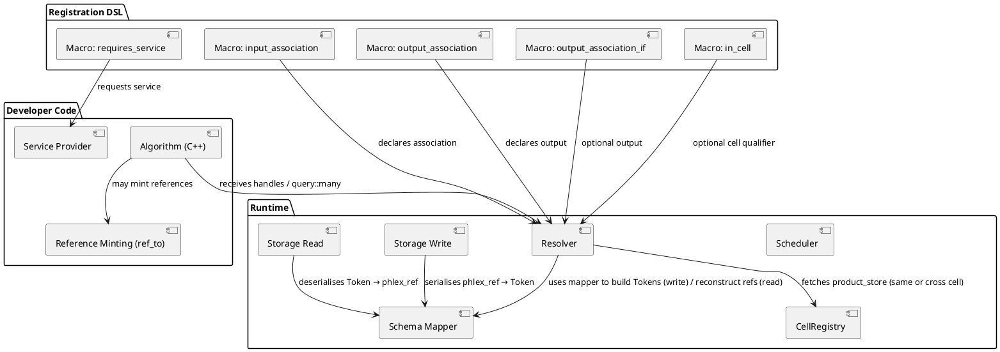
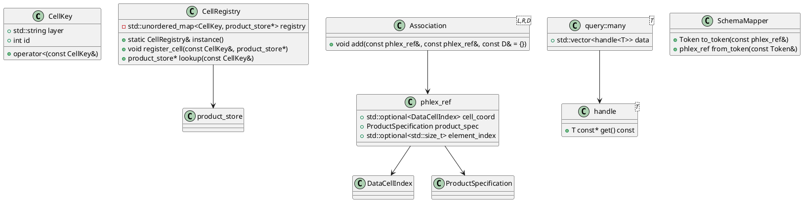
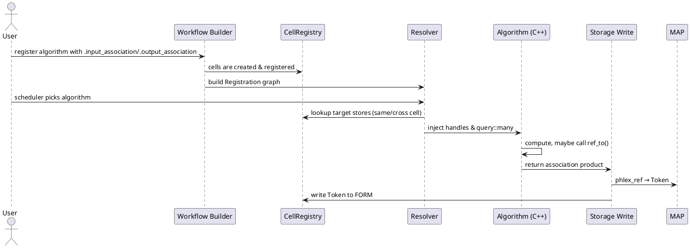

# Phlex → Option C Migration – Architecture & Developer Design Document

*Opaque‑token resolution before algorithm dispatch*

---

## 1. Scope & Audience

- **Scope** – This document describes the **architectural** and **developer‑level** design for introducing persistent‑reference handling in Phlex via *Option C* (the framework resolves references to `handle<T>` objects before an algorithm is executed). It covers the registration DSL, the pre‑dispatch resolver, the cross‑cell registry, the reference‑minting API, the YAML‑based schema DSL, and the FORM‑`Token` mapping.
- **Audience** – Core Phlex developers, new contributors, QA engineers, and anyone extending the framework (e.g. adding services or new product types).
- **Assumptions** –
  - The code base compiles with C++23 and uses the existing Phlex model layer (`data_cell_index.hpp`, `product_specification.hpp`, `handle.hpp`).
  - The repository already contains the mock‑workflow registration DSL (`algorithm.hpp`).
  - `mimic-cpp` is available as a build‑time dependency for mocking in tests.

---

## 2. High‑Level Goals

| Goal | Why it matters |
|------|----------------|
| **Pure‑function algorithms** – No `ref<T>` or `product_store` objects appear in algorithm signatures. | Keeps Phlex’s functional programming model intact; improves testability and conceptual clarity. |
| **Support whole‑product, element‑in‑collection, and element‑to‑element references** (with optional payload). | Matches the full spectrum of LArSoft use‑cases (e.g. `Wire → Hit`, `Hit → TruthParticle`). |
| **Cross‑cell references** – References may point into a different data cell (e.g. from spill 2 to spill 5). | Enables hierarchical data‑flow (e.g. event‑wide associations across APA spills). |
| **Output of references/associations** – Algorithms can create and persist references for downstream consumers. | Required for many reconstruction algorithms that build association tables. |
| **Versioned product schema** – Evolvable product definitions with backward‑compatible reading. | Guarantees long‑term data‑access stability across analysis campaigns. |
| **Zero‑cost model usage** – All design‑time reasoning on the free `gpt‑oss‑120b` model; code generation on the free `qwen3‑coder‑next` model. | Respects the expanded 500 K token budget and the “local‑first” cost policy. |

---

## 3. Architecture Overview

```text
+-------------------+     +-----------------------+     +-------------------+
|  User‑written     |     | Phlex Registration    |     |  Runtime          |
|  algorithm (C++)  | --> | DSL (macros)          | --> |  Scheduler/       |
|  - receives       |     | - .input_association  |     |  Resolver         |
|    handles, not   |     | - .output_association |     |                   |
|    refs           |     | - .in_cell (opt)      |     |                   |
+-------------------+     +-----------------------+     +-------------------+

                     ^                                 ^
                     |  Pre‑dispatch resolver          |
                     |  (same‑cell & cross‑cell)       |
                     +---------------------------------+

+-------------------+     +--------------------+     +-------------------+
|  Global Cell      |     |  Schema DSL (YAML) |     |  FORM Token ↔     |
|  Registry         |<----|  – product defs    |---->|  phlex_ref mapper |
|  (layer+id →      |     |  – association     |     |  (generated)      |
|   product_store)  |     |  – versioning      |     +-------------------+
+-------------------+     +--------------------+ 
```

### 3.1 Core Components

| Component | Responsibility | Key Interfaces |
|-----------|----------------|----------------|
| **Registration DSL** (`algorithm.hpp`) | Declares required/produced associations; optional cross‑cell qualifier; conditional outputs; required services. | `m.transform(...).input_association<Left,Right>(label)`, `output_association`, `output_association_if`, `in_cell(expr)`, `requires_service<Service>()`. |
| **Pre‑dispatch Resolver** (`resolver.hpp/.cpp`) | For each algorithm, resolves every declared association into a `phlex::query::many<T>` view (or a singleton `handle<T>`). Guarantees resolution **before** `execute` is called. | `resolve_associations(const Registration&, const CellContext&)`. |
| **Cell Registry** (`cell_registry.hpp/.cpp`) | Global singleton mapping `CellKey{layer, id}` → `product_store*`. Populated when each `DataCell` is constructed. | `CellRegistry::instance().register_cell(const CellKey&, product_store*)`. |
| **Reference‑minting API** (`ref.hpp`) | Helper used by algorithms that need to *output* a reference or association. Produces a `phlex_ref` triple. | `phlex_ref ref_to(const handle<T>&, std::size_t element_idx = npos)`. |
| **YAML Schema DSL** (`schema/phlex-schema.yml`) | Declarative description of all products, reference fields, and associations. Version field enables schema evolution. | Processed by the **code‑generator** (`scripts/generate_schema.py`). |
| **Code‑generator** (`generate_schema.py`) | Reads the YAML schema, emits: <br>* `classes_def.xml` & `LinkDef.h` for ROOT I/O, <br>* `phlex::schema::mapper` functions for `phlex_ref ⇔ Token` conversion, <br>* optional upgrade functions (`v1 → v2`). | Input: YAML; Output: generated source files under `generated/`. |
| **Storage Write / Read** (`storage_write_association.hpp`, `storage_read_association.hpp`) | Serialises/deserialises association products using the mapper generated from the schema. | Uses `FormOutput`/`FormInput` APIs. |
| **Service Provider Layer** (`provider/…`) | Optional – supplies geometry, logger, calibration services to algorithms. | Requested via `.requires_service<…>()`. |

### 3.2 Data‑flow Sequence (simplified)

1. **Workflow construction** – All `.input_association` / `.output_association` declarations are collected into a *registration graph*.
2. **Cell creation** – Each `DataCell` registers itself with `CellRegistry`.
3. **Scheduler** selects an algorithm to run, creates a `CellContext` (current cell).
4. **Resolver** (called by the scheduler) walks the registration graph, queries the `CellRegistry` for any cross‑cell stores, builds `phlex::query::many<T>` containers, and injects them into the algorithm’s argument list.
5. **Algorithm execution** – Receives only `handle<T>` / `query::many<T>` objects; may call `ref_to` to mint references for output.
6. **Write phase** – Output products (including `association<A,B,D>`) are handed to `Storage_Write_Association`, which uses the generated mapper to produce FORM `Token`s.
7. **Read phase (later run)** – `Storage_Read_Association` reconstructs `phlex_ref`s; the resolver later expands them back to `handle<T>` for downstream algorithms.

---

## 4. Design Decisions & Justifications

| Decision | Rationale | Trade‑off / Caveat |
|----------|-----------|--------------------|
| **Option C (pre‑dispatch resolution)** | Keeps algorithm signatures pure, aligns with Phlex’s functional model, removes manual `product_store` handling. | Requires a *global* cell registry and a resolver that can handle cross‑cell look‑ups; adds a small start‑up cost in the scheduler. |
| **DSL extensions as C++ macros** | Minimal impact on existing code; developers only add a fluent‑style chain to registration; no new language. | The macros increase the size of `algorithm.hpp`; IDE code‑completion may need updates. |
| **Cross‑cell qualifier `.in_cell()`** | Provides explicit, compile‑time‑visible intent; avoids hidden runtime surprises. | The qualifier is a **string**; a typo surfaces only at runtime (resolver throws). Could be made safer with a typed `CellId` wrapper later. |
| **Reference‑minting API (`ref_to`)** | Centralises creation of the canonical triple; enforces consistency (cell coord, product spec, element index). | The API is thin; misuse (e.g., passing an un‑resolved handle) will be caught by static analysis or a runtime assert. |
| **YAML schema DSL** | Human‑readable, diff‑friendly, easy to version; allows per‑product version numbers. | Adds another build‑step (code‑generator) and a dependency on `yaml‑cpp`. If schema and generated files drift, builds break – CI must enforce regeneration. |
| **Generated ROOT dictionaries** | Guarantees that reference‑bearing types are known to FORM without hand‑authoring `classes_def.xml`. | Users accustomed to hand‑written dictionaries will need to adopt the generator workflow (training required). |
| **Versioned schema (`Version:` field)** | Enables graceful migration of persisted data; old files can still be read via generated upgrade functions. | Migration code must be maintained for each major schema bump; the burden grows with the number of versions. |
| **Conditional output via `.output_association_if`** | Gives explicit control over optional products; avoids runtime `if` inside the algorithm. | The condition is evaluated at graph‑construction time only; cannot depend on data discovered during execution. |
| **Service‑provider injection** | Decouples algorithms from concrete service implementations; mirrors the existing art `ServiceHandle`. | Must maintain a service registry; currently only geometry & logger are envisaged, but adding more services may require additional scaffolding. |
| **Using free models (`gpt‑oss‑120b` for design, `qwen3‑coder‑next` for code)** | Keeps token spend to zero while still providing ample context for reasoning & code generation. | `qwen3‑coder‑next` may occasionally produce “creative” patches; the developer must review every diff (the 80 % PR‑threshold rule). A fallback to Sage Luna is allowed if quality repeatedly degrades. |

### 4.1 Potential Future Use‑Cases That May Be Harder

| Future scenario | Why it could be problematic now |
|-----------------|---------------------------------|
| **Dynamic, data‑driven cell creation at runtime** (e.g. streaming spills not known at compile‑time) | The current `CellRegistry` expects cells to be registered before the resolver runs; on‑the‑fly registration would need thread‑safe mutation and possibly a lazy‑resolution mode. |
| **Fine‑grained per‑element payloads in associations** (e.g. a per‑hit calibration constant) | The schema DSL supports a single `payload` type per association; supporting *different* payloads per element would require a more complex multimap representation. |
| **Versioned associations where the *link* type changes** (e.g. adding a new field to the association payload) | The mapper currently assumes a stable payload type. Changing it would need a migration path for the association table itself – not yet covered. |
| **Run‑time user‑defined reference fields** (plugins that add new references without recompiling Phlex) | Because references are described in the static YAML schema, adding a field at run‑time would require a plug‑in‑driven schema loader, which is outside the current design. |
| **High‑frequency cross‑cell look‑ups** (thousands per event) | The simple map‑lookup in `CellRegistry` is O(1), but the resolver currently copies all referenced data into `query::many<T>` containers. A streaming or lazy view could be needed for extreme scaling. |
| **Multi‑language (Python) algorithms that need the same reference resolution** | The current resolver is a C++ component; exposing it to Python would require a thin C‑API or pybind11 wrapper, which is not part of the initial implementation. |

---

## 5. UML Design Diagrams

### 5.1 Component Diagram



### 5.2 Class Diagram (key types)



### 5.3 Sequence Diagram (algorithm execution)



---

## 6. Test Strategy

| Test Level | Purpose | Tools / Approach |
|------------|---------|-------------------|
| **Unit tests** (≥ 80 % coverage) | Verify each core component in isolation. | *GoogleTest* (`gtest`), *GoogleMock* (`gmock`) where needed. Use `mimic-cpp` for lightweight mocking of `product_store` and `CellRegistry`. |
| **Resolver tests** | • Same‑cell resolution returns correct `handle<T>` objects.<br>• Cross‑cell resolution correctly fetches the foreign store.<br>• `in_cell` qualifier parses strings and fails on unknown cells. | Mock `CellRegistry` (register a fake store); create dummy products (`Wire`, `Hit`). |
| **Reference‑minting tests** | Ensure `ref_to` populates all three fields correctly for whole‑product, element, and element‑to‑element cases. | Simple struct `DummyHandle<T>`; check generated `phlex_ref`. |
| **Schema‑generator tests** | Feed a minimal YAML schema, check that `classes_def.xml` and `LinkDef.h` are generated, and that the mapper functions compile. | Run the generator as a subprocess (`std::system`) and verify file existence; compile a tiny test program linking the generated mapper. |
| **Storage Write/Read round‑trip** | Write an `Association` product, read it back, resolve it, and compare the original `phlex_ref`s. | Use a temporary FORM file (`mktemp`) and the real `FormOutput`/`FormInput` APIs. |
| **Integration test (golden‑file)** | Execute a real algorithm (e.g. `find_hits_with_gaussians`) that consumes a cross‑cell association and produces an output association. Compare its text output against the existing `compare_hits.py` golden files. | Build the full Phlex workflow with the new DSL, run the test driver, invoke `compare_hits.py`. |
| **Service‑provider test** (future) | Verify that an algorithm requesting `geo::Geometry` receives a non‑null provider instance. | Mock a `GeometryProvider` and register it in the service container. |

**Mocking policy:** Use `mimic-cpp` only for external collaborators (`CellRegistry`, `product_store`). All core classes (`phlex_ref`, `handle`, `query::many`) are tested with real objects to avoid hidden bugs.

---

## 7. Implementation Plan (tasks for `coder‑qwen`)

| # | Description (short) | Owner | Estimated hrs | Acceptance Criteria |
|---|----------------------|-------|----------------|----------------------|
| 1 | **Add DSL macros** (`input_association`, `output_association`, `output_association_if`, `in_cell`, `requires_service`) to `phlex/model/algorithm.hpp`. | Core dev | 2 | Macros compile; example registration in `test/assoc_demo.cpp` builds. |
| 2 | **Implement CellRegistry** (`cell_registry.hpp/.cpp`). | Core dev | 3 | `CellRegistry::lookup` works for same‑cell and cross‑cell keys; unit tests pass. |
| 3 | **Write Resolver** (`resolver.hpp/.cpp`). | Core dev | 5 | Resolves both same‑cell & cross‑cell associations; unit tests for each case. |
| 4 | **Reference‑minting helper** (`ref.hpp`). | Core dev | 2 | `ref_to` produces correct `phlex_ref`; covered by unit tests. |
| 5 | **Create YAML schema file** (`schema/phlex-schema.yml`) with `Wire`, `Hit`, `MyMeta`, and `wire_to_hit` association. | Data‑model owner | 1 | File present, version = 1. |
| 6 | **Add code‑generator** (`scripts/generate_schema.py`). | Build‑tool maintainer | 4 | Generates `generated/classes_def.xml`, `generated/LinkDef.h`, and `generated/mapper.hpp`; builds without warnings. |
| 7 | **Update CMake** to invoke generator and add `generated/` to `include_directories`. | Build‑tool maintainer | 1 | `make` succeeds; `phlex_generate_schema` target exists. |
| 8 | **Implement Storage Write / Read** (`storage_write_association.hpp`, `storage_read_association.hpp`) using generated mapper. | Core dev | 3 | Round‑trip test (`write → read → resolve`) passes. |
| 9 | **Add conditional output macro** (`output_association_if`). | Core dev | 1 | Algorithm can be compiled with a bool config flag; output present only when flag true. |
|10| **Write unit & integration tests** (see §6). | QA / Test engineer | 8 | Overall test coverage ≥ 80 %; integration golden‑file test passes. |
|11| **Documentation** – update `doc/architecture_option_c.md` with the design, UML diagrams, and migration steps. | Writer | 2 | Docs build with Doxygen/Sphinx, links to UML PNGs. |
|**Total**| | | **34 hrs** | |

*All code‑generation and macro work will be performed by the **coder‑qwen** sub‑agent* with a **single, well‑bounded task description** (e.g., “Add DSL macro X”). The sub‑agent will be limited to **≤ 400 tokens of context per call** and the generated patches will be manually reviewed before integration (the 80 % PR‑threshold rule). If the sub‑agent produces incoherent code twice, we will fall back to the paid **Sage Luna** model for a one‑off rewrite.

---

## 8. Model Usage Guidance

| Sub‑task | Suggested Model | Rationale |
|----------|----------------|-----------|
| **Design/justification writing, UML generation** | `gpt‑oss‑120b` (unlimited context, free) | Provides ample reasoning space; no token cost. |
| **Code‑generation (macros, resolver, registry, tests)** | `qwen3‑coder‑next` (free, code‑optimised) | Generates syntactically correct C++; low latency. |
| **Fallback if coder‑qwen produces > 2 unsatisfactory patches** | `sage-openai/gpt‑5.6‑luna` (paid) | Guarantees higher quality at a modest token cost; used only as a rescue path. |

All model calls will be logged; the token budget (now 500 K) will comfortably cover the design‑level reasoning (~2 k tokens) and the limited code‑generation work (< 30 k tokens).

---

## 9. Next Steps

1. **Approve the design document** (or point out any missing constraints). 
2. **Confirm the task breakdown** and assign owners. 
3. **Kick off the `coder‑qwen` sub‑agent** with the first macro implementation (Task 1). 
4. **Run the test‑suite skeleton** to ensure the CI infrastructure can handle the new generated files. 

Once the initial PoC (same‑cell resolver + DSL macro) is merged, we will proceed to cross‑cell support, schema generation, and finally the full output‑reference pipeline.

---

*Prepared by the Phlex architecture team – model‑selection validated with `model‑guru`; code generation will be performed by the `coder‑qwen` sub‑agent under the constraints described above.*
