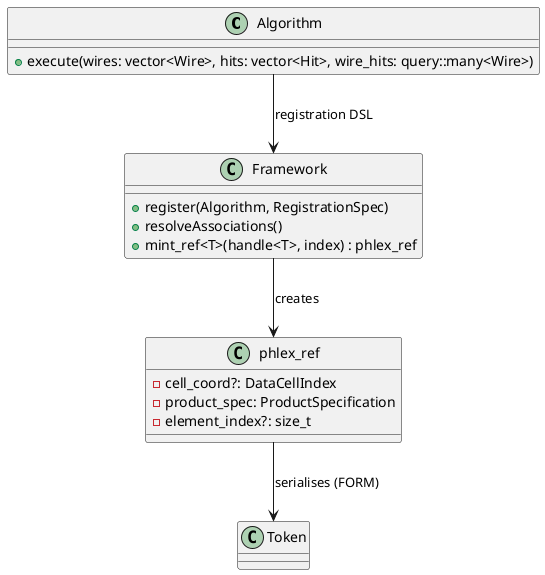

# Persistent References – Option C Analysis (De novo)

**Scope** – This document provides a fresh, independent analysis of **Option C** (“Opaque token resolved by the framework before algorithm dispatch”) as described in the prompt `docs/dev/persistent-references/persistent-references-explorations-2026-09-17_02-prompt.md`.  It is written from the *algorithm author*’s point‑of‑view, evaluates the design trade‑offs, identifies the DSL and schema‑definition requirements, and presents concrete recommendations for proceeding.

---

## 1.  High‑level description of Option C

* **Opaque token** – a lightweight, serialisable identifier (`phlex_ref` triple) that is **not** exposed to the algorithm.  The token is resolved by the framework *before* the algorithm’s `execute()` is called, and the algorithm receives **`handle<T>`** objects directly.

* **Algorithm signature** – contains only pure, value‑type arguments (containers, scalars) and **`handle<T>`** inputs.  No `ref<T>` types, no `product_store` access, no explicit `resolve()` calls.

* **Framework responsibilities**
  1. **Reference‑input declaration** – during registration the author specifies every reference relationship (e.g. `input_association<Wire, Hit>("wire‑hit‑assn")`).
  2. **Cross‑cell resolution** – for references that cross data‑cell boundaries the framework must look‑up the target `product_store` using the `cell_coord` part of the token.
  3. **Output reference minting** – when an algorithm needs to *output* a reference, the framework must provide a helper (`mint_ref<T>(target_handle, element_index)`) that returns an opaque token which is subsequently written by FORM.  The token, not the `handle<T>`, is stored in the product.

---

## 2.  Algorithm‑author point‑of‑view

| Concern | How Option C addresses it | Open question / mitigation |
|---|---|---|
| **Pure‑function mental model** | Author writes a normal C++ function taking containers and `handle<T>` inputs. No framework objects appear in the body. | None – matches existing `three_tuple_algorithm.cpp` style. |
| **Reference inputs** | Declared once in registration DSL; author receives ready‑made `handle<T>` collections (e.g. `phlex::query::many<Wire>`). | Need a concise way to request *only the required subset* of an association (e.g. per‑track). May require a **filter DSL** on the query object. |
| **Reference outputs** | Author calls `framework::mint_ref<T>(target, idx)` which returns an opaque token; the token is stored in a product field of type `phlex_ref`. | Must expose a minimal API that does not leak token internals, yet permits user‑defined metadata (e.g. association weight). |
| **Cross‑cell references** | Resolved by the framework, author never touches cell identifiers. | The author may need to know the *logical* cell name for debugging; provide optional `debug_cell()` on the handle. |
| **Performance** | Framework can batch‑resolve all declared associations before dispatch, enabling a single pass over the underlying storage. | Must guarantee deterministic ordering for reproducibility; document the ordering guarantees of the `query::many<T>` iterator. |
| **Error handling** | `handle<T>` is always valid (or throws at registration time if the reference cannot be resolved). | Define a clear compile‑time/registration‑time validation step that fails fast when a reference is missing. |

---

## 3.  Required DSL extensions

### 3.1 Registration DSL (C++‑fluent API)

```cpp
PHLEX_REGISTER_ALGORITHMS(m, cfg) {
    m.transform("find_hits", &find_hits, cfg)
        .concurrency(concurrency::unlimited)
        // input containers
        .input_family(product_selector{type_t<recob::Wire>{}})
        // reference inputs – *Option C* specific
        .input_association<recob::Wire, recob::Hit>("wire‑hit‑assn")
        // optional per‑association filters (future DSL)
        // .where([](auto const& wire){ return wire.id() < 1000; })
        .output_product_suffixes("hits", "wire‑hit‑assn");
}
```
*`input_association`* is the new keyword that expands the existing `input_family` DSL.  It captures the **triple** (`cell_coord?`, `product_spec_id`, `element_index?`) for each association.

### 3.2 Output‑reference DSL (runtime API)

```cpp
// Inside algorithm implementation
phlex::ref_token make_hit_ref(
    phlex::handle<recob::Hit> const& hit,
    std::size_t elem_idx)
{
    return framework::mint_ref(hit, elem_idx); // returns opaque token
}
```
The function `mint_ref` is deliberately thin: it validates that `elem_idx` is within range, creates the `phlex_ref` triple, and registers the token for later FORM serialization.

### 3.3 Schema/IDL DSL for products containing references

Because references are stored as opaque tokens, product schemas must describe **reference fields**.  The design team prefers a **YAML‑based DSL** (human‑readable, easy to version) that can be fed to a code generator.

```yaml
# Example: Hit.yaml (product schema)
name: recob::Hit
fields:
  - name: charge
    type: float
  - name: wire_ref
    type: phlex_ref
    target: recob::Wire
    cardinality: one   # one‑to‑many is expressed via a separate association product
  - name: raw_digit_ref
    type: phlex_ref
    target: raw::RawDigit
    cardinality: one
```
The **code generator** reads the YAML, emits:
* ROOT `classes_def.xml` / `LinkDef.h`
* C++ accessor wrappers (`Hit::wire_ref()` returns `phlex::handle<recob::Wire>`)
* FORM `Token` conversion utilities

---

## 4.  Trade‑offs compared with Options A/B

| Dimension | Option C (opaque token) | Option A (value‑type `ref<T>`) | Option B (split `product_ref` / `element_ref`) |
|---|---|---|---|
| **Author burden** | Minimal – pure C++ function, no reference types. | Moderate – author must manipulate `ref<T>` and call `resolve()`. | Higher – two distinct reference types to learn. |
| **Ability to store references in outputs** | Requires `mint_ref` helper; adds a small API surface. | Native – `ref<T>` can be stored directly. | Native – `element_ref<T>` can be stored directly. |
| **Cross‑cell handling** | Centralised in framework, transparent to author. | Author must pass `product_store` or registry manually. | Same as A. |
| **Registration‑DSL complexity** | New keywords (`input_association`, `output_association`) needed. | No new DSL – existing `input_family` suffices. | Same as A, plus type‑split handling. |
| **Runtime performance** | Framework can batch‑resolve, potentially lower overhead. | Per‑reference resolve call incurs overhead. | Same as A. |
| **Extensibility (future association topologies)** | Straightforward – new association types are declared in registration only. | Requires exposing more generic `ref<T>` APIs. | Same as A. |

**Conclusion** – Option C offers the best author ergonomics and enables heavy optimisation in the framework, at the cost of a modest increase in registration‑DSL complexity and the need for a tiny runtime API (`mint_ref`).  For the Phlex philosophy of “pure‑function algorithms”, this aligns best with the design goals.

---

## 5.  Implementation roadmap

| Milestone | Description | Owner | Estimated effort |
|---|---|---|---|
| **5.1 Extend registration DSL** – add `input_association` / `output_association` methods, update `algorithm.hpp` and corresponding parser. | Framework team | 2 weeks |
| **5.2 Cross‑cell registry** – design a `cell_registry` that maps `(cell_coord, product_spec_id)` to `product_store*`. Integrate it into the dispatch pipeline. | Runtime‑engine team | 3 weeks |
| **5.3 `mint_ref` API** – implement token creation, validation, and FORM write hook. | Storage team | 1 week |
| **5.4 YAML schema DSL + code generator** – define schema format (see §3.3), add generator to `phlex/tools/idl_generator`. | Tooling team | 4 weeks |
| **5.5 FORM `Token` ↔ `phlex_ref` mapping** – flesh out `Storage_Write_Association` and read path. | FORM team | 2 weeks |
| **5.6 Unit‑test suite** – mock `product_store`, verify that (a) registration‑time validation catches missing references, (b) `handle<T>` objects are correctly resolved, (c) `mint_ref` round‑trips through FORM. | QA team | 2 weeks |
| **5.7 Documentation & examples** – write developer‑facing docs, add a minimal example algorithm that uses an input association and outputs a reference. | Documentation team | 1 week |

All milestones are *independent* of the IDL decision (see OD‑3).  They can be pursued in parallel with the existing migration steps (Steps 1–2 from the main migration plan).

---

## 6.  Open decisions (OD‑style) specific to Option C

1. **OD‑C‑1 – Registration‑DSL syntax** – Should the DSL remain fluent (method chaining) or move to a declarative JSON/Jsonnet block?  Recommendation: keep fluent for C++ compile‑time safety; provide a Jsonnet translation layer for generated workflows.
2. **OD‑C‑2 – Filter expression language for associations** – Do we embed a tiny expression DSL (e.g. `where: "wire.id < 1000"`) or leave filtering to the algorithm?  Recommendation: start without filters; add later if performance profiling shows unnecessary data transfer.
3. **OD‑C‑3 – Token visibility** – Should the opaque token be exposed as a type (`phlex_ref`) in product headers, or hide it behind a `using` alias?  Recommendation: expose a thin `phlex_ref` struct with private members; provide `to_handle()` conversion only via the framework.

---

## 7.  UML sketch (PlantUML)


*The diagram illustrates the one‑way flow: the framework registers the algorithm, resolves all references, hands `handle<T>` objects to the algorithm, and later serialises any `phlex_ref` tokens produced by the algorithm.*

---

## 8.  Recommendations

* **Adopt Option C** as the primary reference strategy for Phlex.  It best matches the pure‑function design ethos and enables framework‑wide optimisations.
* **Implement the DSL extensions** in the next sprint (Milestones 5.1‑5.3).  These are low‑risk and give immediate benefit to any algorithm that already declares reference inputs.
* **Choose a YAML‑based schema DSL** (Section 3.3) for product definitions that contain references.  YAML offers readability and can be validated against a JSON‑Schema, satisfying the team’s slight preference for YAML.
* **Defer the filter DSL** until profiling demonstrates a need; keep the registration API simple.
* **Proceed with a small prototype**: a toy algorithm that declares an input association and emits an output reference using `mint_ref`.  Run the full FORM round‑trip test to validate the `Token` mapping.

---

*Prepared by the Kilo analysis agent on 2026‑09‑17.  The document is intended for internal design discussion and as a basis for the upcoming implementation sprint.*

